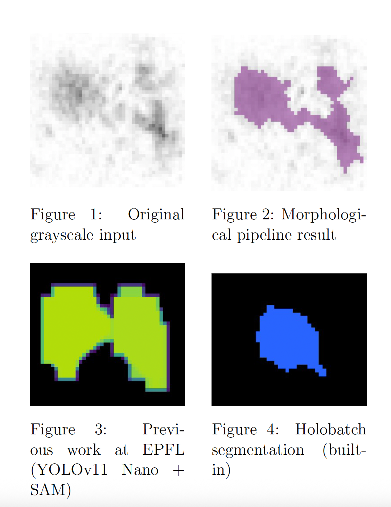
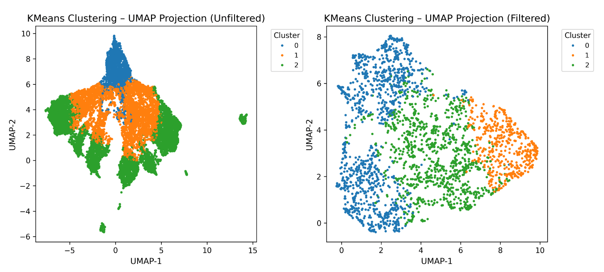
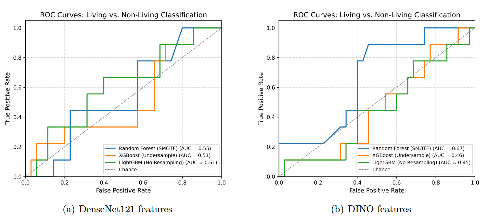

# Automated Identification and Characterization of Particles in Holographic Images from Lake Geneva

This repository contains code and notebooks for my semester project, conducted at the [EPFL Center for Imaging](https://imaging.epfl.ch) and [LIMNC](https://www.epfl.ch/research/domains/limnc/). The project focuses on detecting, segmenting, and classifying particles (e.g., plankton and sediment) imaged using the LISST-Holo2 underwater holographic camera.

The goal is to extract both handcrafted and learned features from particles, assess their structure using clustering, and classify them into `Living` vs. `Non-Living` categories using supervised learning.

---
## Project Overview

### Segmentation comparison
<p align="center">
  
  <br>
  <em>Our morphological segmentation pipeline preserves contours and texture without GPU inference.</em>
</p>

### Feature space visualization
<p align="center">
  
  <br>
  <em>UMAP projection of particle features — clusters highly overlap, indicating weak separability.</em>
</p>

### Classification performance
<p align="center">
  
  <br>
  <em>ROC curves for Random Forest, XGBoost, and LightGBM — limited separability between Living and Non-Living.</em>
</p>

---

## Repository Structure

| File | Description |
|------|-------------|
| `src/preprocessing_creating_ROI_NN.ipynb` | Preprocessing and ROI creation for feature extraction (including DenseNet compatibility) |
| `src/shape_analysis.ipynb` | Extracts handcrafted shape, texture, and intensity features from segmented ROIs |
| `src/classification.ipynb` | Supervised classification using handcrafted features (Random Forest, XGBoost, LightGBM) |
| `src/NN_features.ipynb` | DenseNet121-based feature extraction and classification |
| `src/dino_extraction_classification.ipynb` | Self-supervised DINO feature extraction and classification |
| `src/size_vs_no_size_filter.ipynb` | Clustering analysis with and without area filtering |
| `/report` | Scientif report  |
| `/media` | Illustrating figures |

---

## Requirements

You can install the required Python libraries using:

```bash
pip install -r requirements.txt
```

The main packages used include:

 - `numpy`, `pandas`, `scikit-learn`, `matplotlib`, `seaborn`
- `torch`, `torchvision`
- `umap-learn`, `scikit-image`, `albumentations`

If you're using conda, we recommend creating a dedicated environment:

```bash
conda create -n lake_snow python=3.10
conda activate lake_snow
pip install -r requirements.txt
```

### DINO Installation

This project uses DINOv2 (ViT-S/14) for self-supervised feature extraction.  
Please follow the installation instructions from the official repository:  
https://github.com/facebookresearch/dino

## How to Run the Notebooks
The notebooks are intended to be run in the following general order:

### 1. Preprocessing
- `preprocessing_creating_ROI_NN.ipynb`: Prepares Regions of Interest (ROIs) for feature extraction.

### 2. Feature Extraction
- `shape_analysis.ipynb`: Extracts handcrafted features (shape, texture, intensity).
- `NN_features.ipynb`: Extracts deep features using DenseNet121.
- `dino_extraction_classification.ipynb`: Extracts self-supervised features using DINOv2 and runs the same classification pipeline as in `classification.ipynb`.

### 3. Analysis
- `size_vs_no_size_filter.ipynb`: Performs clustering on feature sets, with and without area filtering.
- `classification.ipynb`: Performs supervised classification (Living vs. Non-Living) using handcrafted features.


## Results & Report 
The full technical report is available in the `report/` folder.

## Data 
Due to size constraints and EPFL policies, raw holographic `.tiff` files and annotated masks are not stored here.
Please contact antoine.tissot-favre@epfl.ch for access if needed.

## Acknowledgments
This work was supervised by:
- Prof. Edward Andò (EPFL Center for Imaging)
- Mallory Wittwer (EPFL Center for Imaging)
- Florian Aymanns (EPFL Center for Imaging)
- Natacha Pasche (LMINC)

